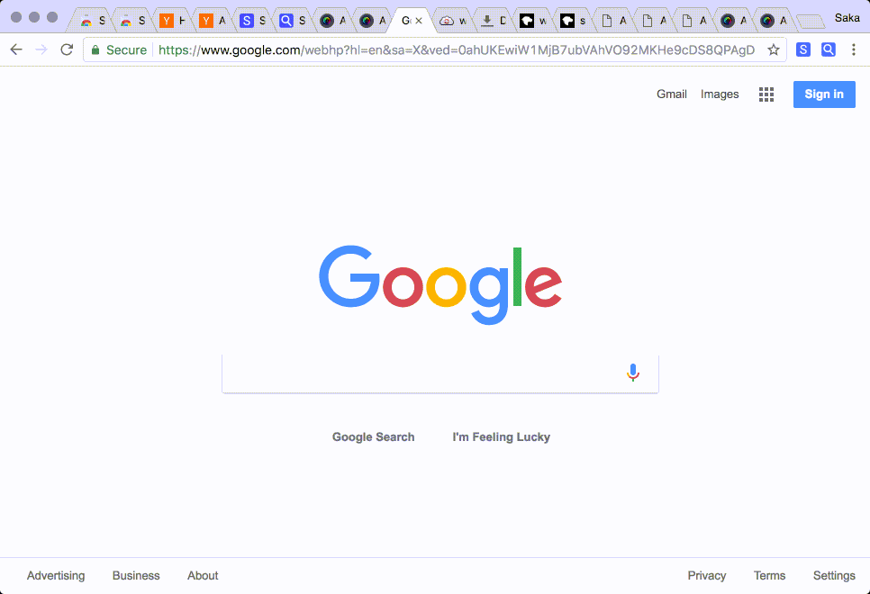

# Saka Key

Saka Key is a Chrome and Firefox extension for keyboard-only web browsing. It's configurable, easy to use, and engineered thoughtfully. Install it from the [Chrome Web Store](https://chrome.google.com/webstore/detail/saka-key/hhhpdkekipnbloiiiiaokibebpdpakdp) or the [Firefox Marketplace](https://addons.mozilla.org/en-US/firefox/addon/saka-key/). Also read the [Saka Key Handbook](https://key.saka.io) and try the accompanying tab search extension [Saka](https://github.com/lusakasa/saka).



### Install

Follow the [Development Setup Guide](https://key.saka.io/docs/developers/setup.html) for detailed instructions. Otherwise:

```sh
git clone https://github.com/lusakasa/saka-key.git
cd saka-key
npm install
# Option 1. Chrome development build
npm run start:chrome
# Option 2. Chrome production build
npm run build:chrome
# Option 3. Firefox development build
npm run start:firefox
# Option 4. Firefox production build
npm run build:firefox
```

## Credits

MIT Licensed, Copyright (c) 2018 Sufyan Dawoodjee, Neil Macintyre, Brandon Kalinowski

Saka Key is inspired by and derives from

- [Vimium](https://github.com/philc/vimium)
- [Vimari](https://github.com/guyht/vimari)
- [cVim](https://github.com/1995eaton/chromium-vim)
- [Surfingkeys](https://github.com/brookhong/Surfingkeys)
- [VimFX](https://github.com/akhodakivskiy/VimFx)
